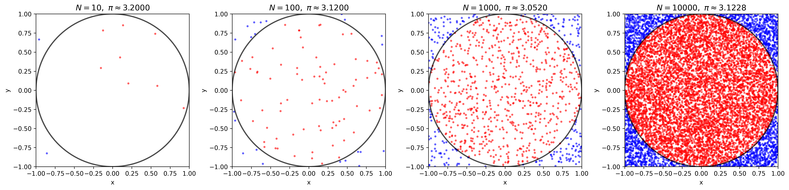
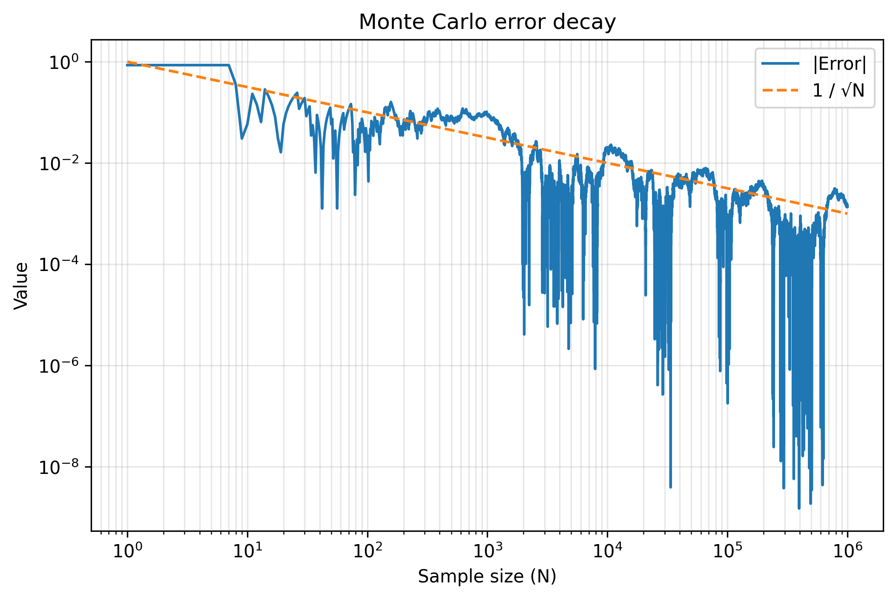

# Monte Carlo Estimation of π

This project estimates the value of π using the Monte Carlo method and random sampling.  
It demonstrates how probabilistic simulation, geometric probability, and the law of large numbers can be used to approximate π and study convergence behavior.

---

## Idea

Random points are uniformly generated inside a square of side length 2.  
The fraction of points that fall inside the unit circle is used to estimate π:

π ≈ 4 × (points inside circle / total points)

As the number of samples increases, the estimate converges to the true value of π.

---

## What this project demonstrates

- Monte Carlo simulation  
- Geometric probability  
- Law of large numbers  
- Convergence of π estimates  
- Error decay proportional to 1/√N  

---

## Results

### Random sampling snapshots
<<<<<<< HEAD

### Convergence of π

### Error scaling

=======

### Convergence of π

### Error scaling

>>>>>>> 5ab4ae7 (Update README for Monte Carlo integration section)

